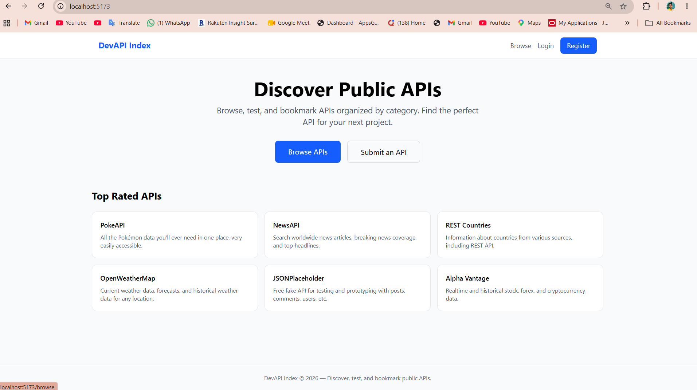
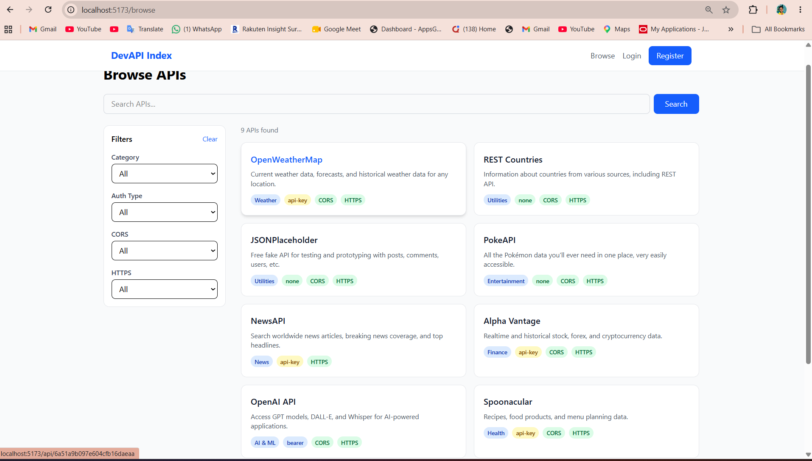
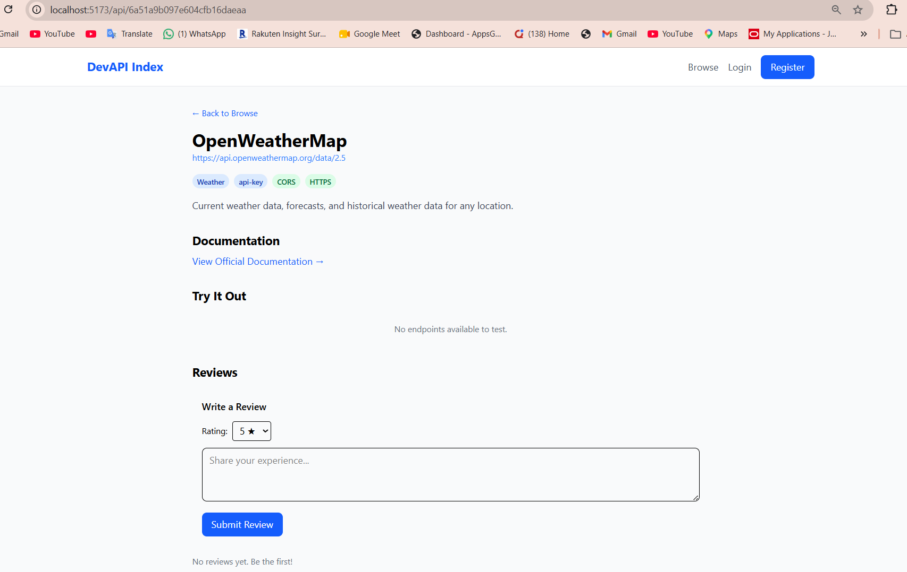
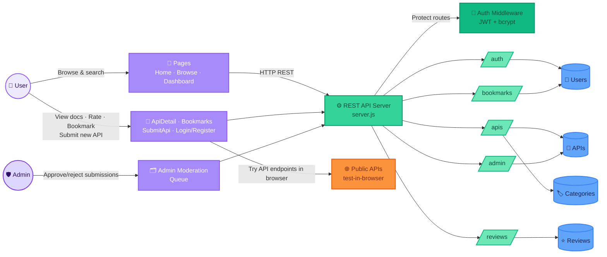

# DevAPI Index

A curated directory where users can discover, test, and bookmark public APIs by category.

## Demo

| Landing Page | Browsing APIs | Testing an API |
| :---: | :---: | :---: |
|  |  |  |

## Tech Stack

- **Frontend:** React (Vite) + React Router + Tailwind CSS
- **Backend:** Express.js + MongoDB (Mongoose)
- **Auth:** JWT + bcrypt

## Getting Started

### Prerequisites

- Node.js (v18+)
- MongoDB (local or Atlas)

### Backend Setup

```bash
cd backend
cp .env.example .env   # update MONGO_URI and JWT_SECRET
npm install
npm run seed            # seed categories + sample APIs
npm run dev             # start server on port 5000
```

### Frontend Setup

```bash
cd frontend
npm install
npm run dev             # start dev server on port 5173
```

## Features

- Browse & search public APIs with filters (auth, CORS, HTTPS, category)
- User registration & login (JWT)
- Bookmark favorite APIs
- Submit new APIs for review
- Ratings & reviews
- Admin moderation queue
- Test-in-browser (try API endpoints)
- API documentation preview

## Project Structure

```
DevAPI_Index/
├── backend/          Express API server
├── frontend/         React SPA (Vite)
└── .gitignore
```

## Architecture


